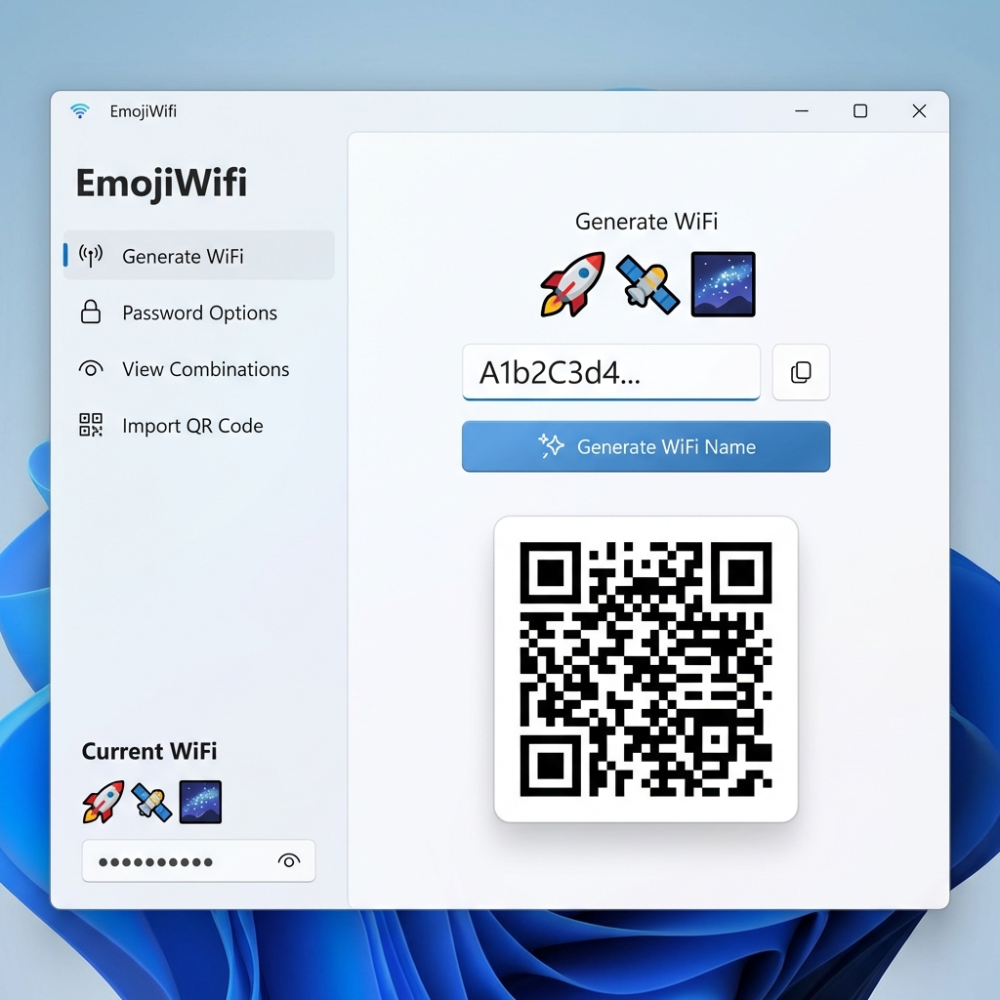

# Emoji Wifi for Windows

**Emoji Wifi** is a fun and modern Windows application that generates emoji-only WiFi names. It is a native port of the [Mac version](https://github.com/dparksports/emoji-wifi-mac-v3), built with WPF and .NET.



## Features

- **Generate Emoji Names**:
  - **Combination**: Curated themed emoji combinations (e.g., "Space Station" 🚀🛰️🌌).
  - **Single Emoji**: Ultra-minimal names like 📶.
  - **Random Length**: Random emoji strings.
- **Password Generation**: Customizable password generation (length, charset).
- **QR Code Support**: 
  - Generate WiFi QR codes to share globally.
  - Import QR codes from images to retrieve credentials.
- **Styles**: Choose between *Emoji Combination*, *Single Emoji*, or *Random Length* styles for your network name.
- **Privacy First**: Fully offline generation logic. Analytics can be opted-out in Settings. EULA included.
- **Wi-Fi Connection**: Simulate joining a network (uses `netsh` integration logic).
- **Modern UI**: Clean, responsive, and beautiful interface designed for Windows 11.

## Getting Started

### Prerequisites

- .NET 8.0 SDK or later.
- Windows 10/11.

### Installation

1. Clone the repository:
   ```bash
   git clone https://github.com/yourusername/emoji-wifi-windows.git
   ```
2. Navigate to the project directory:
   ```bash
   cd emoji-wifi-windows
   ```
3. Run the application:
   ```bash
   dotnet run
   ```

## Download

[**Download v1.3.1 (Windows x64)**](https://github.com/dparksports/emoji-wifi-windows/releases/download/v1.3.1/EmojiWifiWindows.exe)

## Development

The project is built using:
- **WPF** (Windows Presentation Foundation)
- **CommunityToolkit.Mvvm** for MVVM pattern
- **QRCoder** for QR code generation
- **ZXing.Net** for QR code scanning/importing

## License

This project is licensed under the Apache 2.0 License - see the [LICENSE](LICENSE) file for details.

## Credits

Original Mac Application by [dparksports](https://github.com/dparksports).
Ported to Windows by Antigravity.
