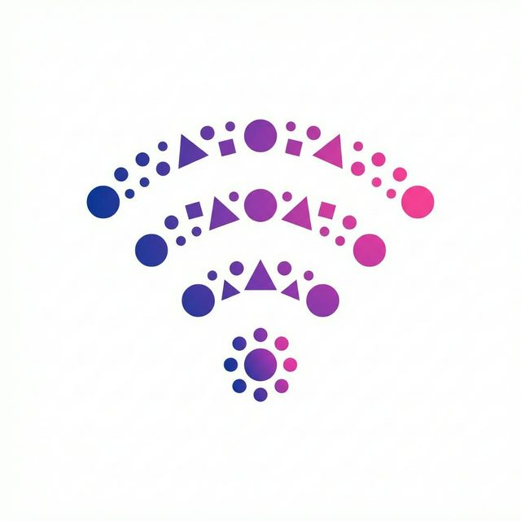

# 📶 Create Your Own WiFi Network with Emoji

**Emoji Wifi** for Windows allows you to turn boring network names into fun, expressive emoji identities. Whether you want a "Space Station" 🚀🛰️🌌 or a "Pizza Party" 🍕🎉, this app makes it easy to generate, secure, and share your new network identity.

## 🎨 Design Your Network

Stop using "NETGEAR-5G" or "xfinity-123". Make your WiFi stand out on every device scan.

1.  **Generate a Name**:
    - **Combinations**: Get inspired by curated themes like *Jungle* 🐯🌴 or *Ocean* 🐙🌊.
    - **Single Emojis**: Go minimal with a single icon like 🏠 or 🔒.
    - **Manual Control**: Type any emojis you want to create your perfect custom name.

2.  **Secure It**:
    - Automatically generate strong, random passwords.
    - Customize password length and complexity (symbols, numbers) to match your security needs.

3.  **Share It**:
    - Instantly generate a **WiFi QR Code**.
    - Friends can scan the code with their phone to join instantly—no typing required.
    - **New in v1.4.1**: Save your favorite configurations to **History** and reload them anytime.

## 📦 Download

[**Download v1.4.1 (Windows x64 Clean Zip)**](https://github.com/dparksports/emoji-wifi-windows/releases/download/v1.4.1/EmojiWifiWindows_v1.4.1_Clean.zip)

*Just unzip and run `EmojiWifiWindows.exe`!*

## 🚀 Features

- **Creating**:
  - ✨ **Emoji Styles**: Combination, Single, Random, or Manual.
  - 🔐 **Secure Passwords**: Built-in cryptographic generator.
  - 📜 **History**: Auto-saves your creations. Delete ones you don't need.

- **Using**:
  - 📱 **QR Code Sharing**: The easiest way to get guests online.
  - 📷 **QR Import**: Lost a password? Scan a saved QR image to retrieve the credentials.
  - 📋 **One-Click Copy**: Copy SSID or Password to clipboard instantly.

- **Private & Safe**:
  - **Offline First**: No internet needed to generate or save.
  - **Privacy**: Analytics are opt-in/opt-out.
  - **Clean**: Native Windows app, no bloatware.

## 💻 Tech Stack

- **Target**: Windows 10/11 (x64)
- **Framework**: .NET 10 & WPF
- **Code**: Native C# with MVVM architecture
- **Open Source**: Licensed under Apache 2.0

## License

This project is licensed under the Apache 2.0 License - see the [LICENSE](LICENSE) file for details.

---
*Make your WiFi smile* 😊
