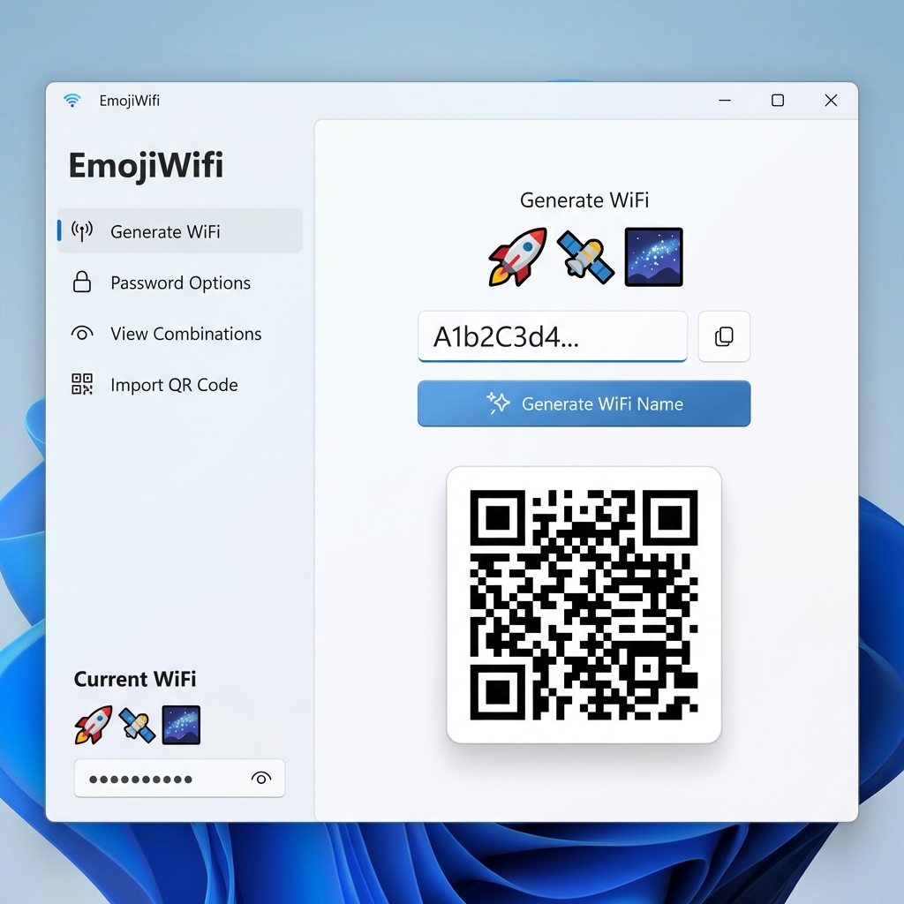

# Emoji Wifi for Windows 🚀

**Emoji Wifi** is a modern, fun, and fast Windows application that generates unique WiFi identities using emojis. Built natively with WPF and .NET 10.



## ✨ Features

- **Generate Unique Identities**:
  - **Styles**: Choose from *Combination* (🚀🛰️), *Single Emoji* (🍕), *Random Length*, or *Manual* input.
  - **Secure Passwords**: Auto-generate strong passwords with customizable complexity (length, symbols, numbers).
  
- **QR Code Magic**:
  - **Generate**: Instantly create WiFi QR codes for easy sharing.
  - **Import**: Scan existing WiFi QR codes from images to recover credentials.
  - **History** (New in v1.4): Automatically saves your generated codes. View, reload, or delete past configurations.

- **Smart & Secure**:
  - **Offline Logic**: All generation happens locally on your machine.
  - **Private**: Analytics are optional and respect your privacy.
  - **Compliance**: Built-in EULA and transparency.

- **Modern UX**:
  - Beautiful, responsive interface designed for Windows 11.
  - Dark/Light mode ready (follows system theme).
  - One-click copy for SSID and Password.

## 📦 Download

[**Download v1.4.0 (Windows x64 Clean Zip)**](https://github.com/dparksports/emoji-wifi-windows/releases/download/v1.4.0/EmojiWifiWindows_v1.4.0_Clean.zip)

## 🚀 Getting Started

### Prerequisites
- Windows 10 or 11 (64-bit)
- .NET 8.0+ Runtime (likely already installed)

### Installation
1. Download the latest release zip.
2. Extract to a folder of your choice.
3. Run `EmojiWifiWindows.exe`.

### Building from Source
1. Clone the repository:
   ```bash
   git clone https://github.com/dparksports/emoji-wifi-windows.git
   ```
2. Navigate to the project directory:
   ```bash
   cd emoji-wifi-windows
   ```
3. Run with .NET CLI:
   ```bash
   dotnet run
   ```

## 🛠️ Tech Stack

- **Framework**: .NET 10 (WPF)
- **Architecture**: MVVM (CommunityToolkit.Mvvm)
- **QR Generation**: QRCoder
- **QR Scanning**: ZXing.Net
- **Emoji Support**: Emoji.Wpf

## 📄 License

This project is licensed under the Apache 2.0 License - see the [LICENSE](LICENSE) file for details.

---
Made with ❤️ in California
